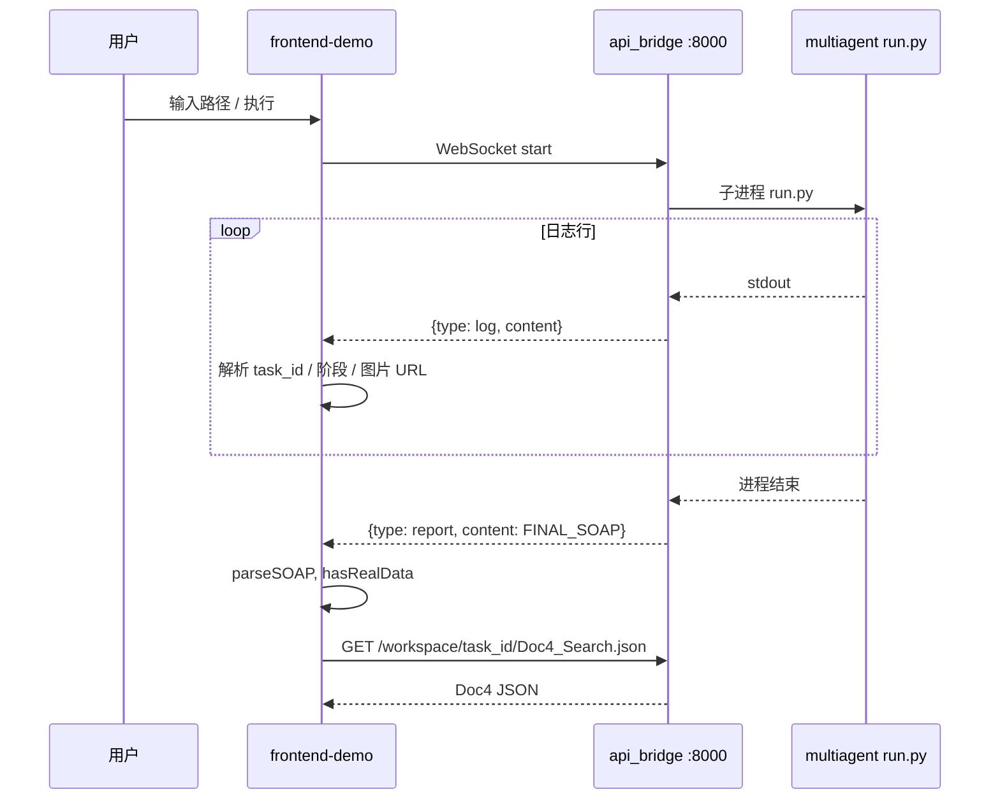

# `frontend-demo` 架构与数据流详解

本文档面向开发与联调人员，说明 `**SatLab/SatVLALab/SatVLALab/frontend-demo**`（SatVLALab Frontend 3.0 Demo）的界面结构、各模块职责、与 `**multiagent**` 后端的连接方式，以及 **Mock 数据与真实数据** 的边界。

相关文档：

- 启动步骤与端口、SSH 转发：见同目录 `[前端启动指南与常见问题.md](./前端启动指南与常见问题.md)`
- `multiagent` 五阶段与产物：见 `[multiagent与frontend-demo项目详细介绍.md](./multiagent与frontend-demo项目详细介绍.md)`
- 视口/布局防整页位移的修复备忘：见 `[前端布局锁定修复说明.txt](./前端布局锁定修复说明.txt)`

---

## 1. 项目定位


| 维度        | 说明                                                                                                        |
| --------- | --------------------------------------------------------------------------------------------------------- |
| **角色**    | 单页演示型前端，用于展示「卫星/遥感图像 → 多阶段 VLM 工作流 → RAG → SOAP 报告」的**产品形态与交互**                                           |
| **与后端关系** | 推理与文件产出全部由 `**multiagent`** 完成；前端通过 `**multiagent/api_bridge.py**`（FastAPI，默认 **8000** 端口）拉日志、拉静态产物、收最终报告 |
| **未完成部分** | 大量左栏配置、右下「卫星动作」等为 **UI 占位 / Mock**，**未**通过 API 反向控制 `run.py` 的参数                                          |


---

## 2. 技术栈与入口


| 类别   | 选型                                         |
| ---- | ------------------------------------------ |
| 框架   | React 18 + TypeScript                      |
| 构建   | Vite 5（开发端口 `**5174`**，见 `vite.config.ts`） |
| 样式   | Tailwind CSS                               |
| 流程图  | React Flow 11 + Dagre 自动布局                 |
| 全局状态 | Zustand（`src/store/useWorkflowStore.ts`）   |


**入口**：`src/main.tsx` → `src/App.tsx`。

---

## 3. 整体布局（三栏）

`App.tsx` 将屏幕分为左、中、右三块（深色主题 + 背景光晕），根级状态仅 `**actionType`**（`'satcomms' | 'satattitude'`），用于右下「任务执行结果」展示切换。

```
┌─────────────────────────────────────────────────────────────────────────┐
│  LeftPanel (~30%, max 320px)  │  CenterPanel (flex-1)  │  RightPanel (~50%, max 500px) │
│  左：配置/演示控件              │  中：图像 + 流程图 + 执行  │  右：RAG + SOAP + 动作结果    │
└─────────────────────────────────────────────────────────────────────────┘
```

---

## 4. 左栏 `LeftPanel`（`src/components/LeftPanel/index.tsx`）

按自上而下 **flex 比例** 分为四块（高度分配见注释）。

### 4.1 `LLaVAControlPanel.tsx` — 推理引擎架构

**界面功能**

- **核心框架**下拉：`Multi-Agent VLM` / `End-to-End LLaVA`（本地 `useState`，**不提交后端**）。
- 在 Multi-Agent 模式下展示文案 `**Qwen-VL · Ollama`**，与当前 `multiagent` 通过 Ollama 调 VLM 的部署方式**概念一致**，但**前端不配置具体模型名**（真实模型名在 `multiagent/vlm/vlm_utils.py`）。
- **五阶段进度条**（全局感知 / 战术指挥 / 局部精析 / 情报提取 / 报告生成）：状态来自 `**useWorkflowStore`** 的 `activeNode`、`isExecuting`、`bypassMidPipeline`。

**与后端关系**


| 数据                              | 是否真实                 | 说明                                                                                        |
| ------------------------------- | -------------------- | ----------------------------------------------------------------------------------------- |
| 五阶段 `idle/running/done/skipped` | **真实**（在 WS 任务成功连接时） | 由日志中的 `🟢 阶段一` … `🟣 阶段五`、`🎉 任务圆满结束`、`0 个目标` 等推导                                         |
| Vision / MLP / LLM 下拉           | **Mock**             | 选项来自 `mockData.ts`（`visionHeadOptions`、`mlpProjectorOptions`、`llmOptions`），**仅 React 状态** |


---

### 4.2 `RAGConfiguration.tsx` — RAG 检索配置

**界面功能**

- **知识库**、**检索算法**两个下拉（`knowledgeBaseOptions`、`retrievalAlgorithmOptions`）。

**与后端关系**

- **完全不联动。** `multiagent` 阶段四在 `tools/RAG/search.py` 中使用 **Tavily HTTP API** 等实现，**不读取**前端任何配置。

**结论**：纯 **Mock UI**，用于演示「可配置知识库」的视觉效果。

---

### 4.3 `SkillLibrary.tsx` — 工具技能库

**界面功能**

- 网格开关：`skillLibraryTools`（如 `cv_tools`、`obj_detect` 等），默认仅 `cv_tools` 开启。

**与后端关系**

- **不控制** `run.py` 工具链。实际工具由 `**state_machine.py` + VLM 决策 + `tool_use.py`** 决定。

**结论**：**Mock**；与 `multiagent/tools` 在命名上**概念对齐**，无 API。

---

### 4.4 `ActionModule.tsx` — 动作执行模块

**界面功能**

- **动作 MLP** 下拉（`actionMlpOptions`）。
- **卫星通信** / **姿态控制** 切换 → 改变 `App` 中 `actionType`。

**与后端关系**

- **不参与** `multiagent` 推理。仅影响右下 `**FinalActionResult`** 展示哪一块静态假数据。

**结论**：**Mock**。

---

## 5. 中栏 `CenterPanel`（`src/components/CenterPanel/index.tsx`）

### 5.1 `ImageViewer.tsx` — 主图像与胶片条

**真实数据（任务运行且 WS 正常）**


| 状态字段           | 来源                 | 含义                                                                                   |
| -------------- | ------------------ | ------------------------------------------------------------------------------------ |
| `mainImageSrc` | `useWorkflowStore` | 当前主图 URL（由日志解析出的 workspace 路径转为 `http://localhost:8000/workspace/...`）               |
| `imageHistory` | 同上                 | 处理链上多帧缩略图（SRC / DEHAZED / DETECTED / ROI / SUPER-RES 等标签由 `deriveImageInfo` 根据文件名推断） |
| `isExecuting`  | 同上                 | 是否正在执行任务                                                                             |


**解析逻辑（与后端日志的对应）**（见 `useWorkflowStore.ts`）：

- 日志匹配 **成功 → `*.png`** 等路径 → 追加 `imageHistory` 并更新 `mainImageSrc`。
- 含 **「检测完成」** → 将当前图 URL 推导为 `**_detected`** 后缀，对应 GroundingDINO 可视化图。
- 若日志含 **BBox 行**（正则）→ 解析 `cropBoxes`（用于与其它模块潜在联动；主图仍以 URL 为主）。

**Mock / 装饰**

- 右上角 **纬度 / 经度 / 高度 / LEO** 为**写死常量**（如 `34.0522° N`），**不是**卫星真实遥测。
- 扫描线、准星、REC 等为纯 UI。

---

### 5.2 `WorkflowGraph.tsx` — 节点工作流链路

**节点顺序（与 `multiagent` 一致）**


| 节点 id        | 界面标题     | 对应 `state_machine` |
| ------------ | -------- | ------------------ |
| `fast_check` | 阶段一 全局感知 | 阶段一                |
| `perception` | 阶段二 战术指挥 | 阶段二                |
| `specialist` | 阶段三 局部精析 | 阶段三                |
| `retrieval`  | 阶段四 情报提取 | 阶段四                |
| `reasoning`  | 阶段五 报告生成 | 阶段五                |


**真实数据**

- `activeNode`、`isExecuting`、`bypassMidPipeline`、`logs` 来自 WebSocket。
- `splitLogsByStage`（`utils/workflowLogSegments.ts`）将日志按阶段切分，用于节点弹窗 **Raw stage trace**。
- 运行中节点 **subline** 显示当前阶段最后一行日志截断。

**节点弹窗 `WorkflowNodeModalBody.tsx`**


| 条件                  | 行为                                                                                                          |
| ------------------- | ----------------------------------------------------------------------------------------------------------- |
| 存在 `workflowTaskId` | `**fetch**` `http://localhost:8000/workspace/<task_id>/Doc1_Global.json` 等（阶段一至四对应 `DOC_FILE` 映射）           |
| 阶段五                 | 额外展示 `**soapRawText**`（WS 推送的全文报告）                                                                          |
| 某阶段日志为空             | 使用 `**buildFallbackBody**` → 内容来自 `**mockData.ts**`（云量、`visualDesc`、`ragContext`、`reasoningRoundsOutput` 等） |


**结论**：有任务时 **结构化 JSON + 日志** 为真；**无任务**时弹窗为 **Mock 占位**。

---

### 5.3 `PromptInput.tsx` — 底部指令行

**行为**

- 用户输入**本地绝对路径**（或留空），回车或点 **执行** → 调用 `startMission(imagePath)`。
- 实际发送 WebSocket：`{ action: 'start', image_path: imagePath ?? '' }`（与 `api_bridge.py` 一致）。

**与后端关系**

- **useWorkflowStore真实触发** `multiagent/run.py`（由 `api_bridge` 子进程执行）。

---

## 6. 右栏 `RightPanel`（`src/components/RightPanel/index.tsx`）

### 6.1 `IntermediateOutput.tsx` — 面板标题「RAG Intel Retrieval」

**行为**

- 当 `workflowTaskId` 存在时，轮询 `**GET http://localhost:8000/workspace/<task_id>/Doc4_Search.json`**（每 3 秒直至成功）。
- 解析 `result` 字符串中 `**【…】**` 段，折叠展示；展示 `**keyword**`。

**与后端关系**

- **真实**：对应 `multiagent` 阶段四写入的 `**Doc4_Search.json`**（`keyword` + Tavily 拼接后的 `result`）。

---

### 6.2 `SOAPOutput.tsx` — SOAP 分析报告

**行为**

- 四张卡片：**S / O / A / P**（中文标题【S/O/A/P】），样式区分颜色。
- 若 `**hasRealData && parsedSOAP`**：文本来自 `**parseSOAPReport**`（解析 WS 推送的 `FINAL_SOAP_REPORT.txt` 中的 `**【S - …】**` 等格式）。
- 否则：**不填充** `mockData.soapOutput`；空闲或无报告时为**空占位**，执行中显示等待态与 `…` + 光标。

**与后端关系**


| 状态                       | 数据来源                 |
| ------------------------ | -------------------- |
| 任务完成且收到 `type: 'report'` | **真实**               |
| 未跑任务、未连上或尚未收到报告          | **无占位正文**（非 mock 文案） |


---

### 6.3 `FinalActionResult.tsx` — 任务执行结果 / VLA 闭环

**行为**

- 使用 `**useWorkflowStore`** 的 `**isExecuting**`、`**hasRealData**`。
- `**hasRealData && !isExecuting**` 时：展示「TRACK 已执行」类文案及卫星通信（压缩率、下行优先级）或姿态（滚转/俯仰/偏航），数值来自 `**mockData.actionResultOutput**`（仅作演示占位）。
- 执行中：显示「任务执行中…」与占位提示；未执行：显示「未执行」，**不**呈现已完成态。

**与后端关系**

- **无真实 JSON 契约**。`multiagent` 不输出此类闭环指令；最终产物为 **SOAP 文本文件**。右下数值仍为 **Mock**，但展示时机与任务状态**已对齐 store**。

**结论**：**数据为 Mock，交互状态为真实**（与 `run.py` 完成/执行中联动）。

---

## 7. 全局状态与后端桥：`useWorkflowStore.ts`

### 7.1 WebSocket

- **URL**：`ws://localhost:8000/ws/mission`（写死）。
- **发送**：`startMission` 后发送 JSON，见上节。

### 7.2 消息类型（与 `api_bridge.py` 对齐）


| `msg.type`                     | 处理                                                                                        |
| ------------------------------ | ----------------------------------------------------------------------------------------- |
| `log`                          | 追加 `logs`；解析 `task_\d{8}_\d{6}` → `workflowTaskId`；按关键字切换 `activeNode`；解析工具成功路径、检测完成、BBox |
| `report`                       | `soapRawText` + `parseSOAPReport` → `parsedSOAP`；`hasRealData = true`                     |
| `system` + `MISSION_COMPLETED` | `isExecuting = false`                                                                     |
| `error`                        | 结束执行并 `console.error`                                                                     |


### 7.3 `activeNode` 与日志关键字映射


| 日志包含        | `activeNode`                     |
| ----------- | -------------------------------- |
| `🟢 阶段一`    | `fast_check`                     |
| `🟡 阶段二`    | `perception`                     |
| `🟠 阶段三`    | `specialist`                     |
| `🔵 阶段四`    | `retrieval`                      |
| `🟣 阶段五`    | `reasoning`                      |
| `🎉 任务圆满结束` | `action`（且 `isExecuting: false`） |


### 7.4 容错 `bypassMidPipeline`

- 若日志含 `**0 个目标，直接跳转阶段五`**，置 `bypassMidPipeline: true`，流程图在结束时将阶段二～四节点显示为 **SKIPPED**。

---

## 8. 后端桥接服务：`multiagent/api_bridge.py`


| 能力        | 路径                                    | 前端使用                  |
| --------- | ------------------------------------- | --------------------- |
| WebSocket | `/ws/mission`                         | `startMission`、日志流、报告 |
| 静态文件      | `/workspace` → `multiagent/workspace` | 图片 URL、`Doc*.json`    |
| 静态文件      | `/data` → `multiagent/data`           | 默认图 `DEFAULT_IMAGE`   |
| HTTP GET  | `/latest-report`                      | **当前前端未引用**（可扩展）      |


子进程执行：`conda` 环境中 `python -u run.py [image_path]`，工作目录为 `multiagent` 根目录。

---

## 9. Mock 数据集中地：`src/mockData.ts`


| 导出项                                                    | 用途                                                               |
| ------------------------------------------------------ | ---------------------------------------------------------------- |
| `TEST_IMAGE_URL` / 与 store 中 `DEFAULT_IMAGE`           | 默认展示图 URL（需 `api_bridge` 提供 `/data`）                             |
| `fastCloudCover`、`cloudCoverThreshold`                 | 流程图阶段一 **无日志** 时的占位指标                                            |
| `visualDesc`、`ragContext`、`reasoningRoundsOutput` 等    | 流程图弹窗 **fallback**                                               |
| `soapOutput`                                           | 仍在 `mockData.ts` 中导出；**SOAP 面板默认不再使用**，无报告时为空                    |
| `actionResultOutput`                                   | 右下 **FinalActionResult**（仅当 `hasRealData && !isExecuting` 时展示数值） |
| `visionHeadOptions`、`mlpProjectorOptions`、`llmOptions` | 左栏 LLaVA 下拉                                                      |
| `knowledgeBaseOptions`、`retrievalAlgorithmOptions`     | 左栏 RAG 下拉                                                        |
| `skillLibraryTools`                                    | 左栏技能库                                                            |
| `actionMlpOptions`                                     | 左栏动作 MLP                                                         |


---

## 10. 与 `multiagent` 产物映射表


| 前端展示                  | `multiagent` 文件 / 行为                   |
| --------------------- | -------------------------------------- |
| 阶段一节点 + Doc1          | `workspace/task_*/Doc1_Global.json`    |
| 阶段二 + Doc2            | `Doc2_Queue.json`                      |
| 阶段三 + Doc3            | `Doc3_Details.json`                    |
| 右栏 RAG + 阶段四节点 + Doc4 | `Doc4_Search.json`                     |
| SOAP 面板 + 阶段五         | `FINAL_SOAP_REPORT.txt`（经 WS `report`） |
| 主图 / 胶片               | `workspace/task_*/**/*.png`（静态挂载）      |


---

## 11. 数据流总览（Mermaid）




---

## 12. Mock vs 真实（汇总表）


| 模块            | 真实数据条件                                    | Mock / 占位                |
| ------------- | ----------------------------------------- | ------------------------ |
| 左栏 LLaVA 下拉   | —                                         | 全部 Mock                  |
| 左栏 RAG 配置     | —                                         | 全部 Mock                  |
| 左栏技能库         | —                                         | 全部 Mock                  |
| 左栏动作 MLP / 模式 | —                                         | 全部 Mock                  |
| 五阶段进度条        | WS 已连接且任务在跑                               | 未连接时无进度                  |
| 中栏主图 + 胶片     | WS 解析到路径                                  | 仅默认图 URL（需 `/data` 可用）   |
| 中栏遥测文字        | —                                         | 写死假数据                    |
| 流程图节点状态       | 同日志                                       | 无日志时无高亮                  |
| 流程图弹窗         | 有 task_id 时拉 Doc + 日志                     | 无日志时 fallback 用 mockData |
| 右栏 RAG 面板     | 有 task_id 时拉 Doc4；`runId` 刷新清空            | 无任务时提示等待                 |
| SOAP 面板       | 收到 `report` 且解析成功                         | 否则空/等待（无默认 mock 正文）      |
| 右下「TRACK」等    | `hasRealData && !isExecuting` 时展示 mock 数值 | 未执行或执行中不显示「已执行」          |
| 底部执行          | 始终发 WS                                    | 后端未启动则失败                 |


---

## 13. 联调检查清单

1. `**api_bridge.py**` 在 **8000** 端口运行，`multiagent/data` 下存在默认图（若使用默认图）。
2. 若前端报 WebSocket 失败，检查防火墙与本机 `**localhost:8000`**。
3. `**Doc4_Search.json` 轮询失败**：确认任务已生成该文件、路径中 `**task_id`** 与日志一致。
4. 左栏任何下拉**不会**改变 Tavily / Ollama / 工具选择；改行为需改 `**multiagent`** 源码或后续增加 API。

---

## 14. 结论

- `**frontend-demo**` 是一条 **「可视化 + 静态拉取 + 日志驱动」** 的演示链路：**真实部分**高度依赖 `**api_bridge` + `multiagent` 运行成功**。
- **配置类 UI** 与 **卫星动作结果** 仍为 **Mock**，与后端数据契约 **未对齐**；若要做生产级产品，需要把左栏参数与 `run.py` / 配置文件或后端 API 打通，并替换右下动作为真实业务或删除。

---

*文档版本：3.0，与仓库 `frontend-demo` 源码一致梳理；后端路径以 `multiagent` 仓库内为准。*