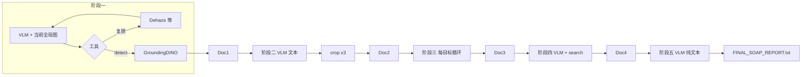

# `multiagent` 后端流程与数据流详解

本文档仅聚焦 **`@ljy/multiagent` 后端**：从入口到各阶段的数据如何流动、每一轮调用什么模型、系统/用户提示词在哪里、以及一次真实任务（`task_20260326_092756`）的示例产物与日志对应关系。可与总览文档 [`multiagent与frontend-demo项目详细介绍.md`](./multiagent与frontend-demo项目详细介绍.md) 配合阅读。

---

## 1. 总览：谁在“思考”，谁在“算图”

| 类型 | 组件 | 说明 |
|------|------|------|
| **大语言/视觉语言模型（VLM）** | 通过 **Ollama** 调用的 `qwen3.5:9b`（配置见 `vlm/vlm_utils.py`） | 各阶段“决策、描述、排序、关键词、写报告”均由该模型完成；请求走 `http://localhost:11434/api/chat`。 |
| **传统 CV / 检测模型** | DehazeFormer、Restormer、GroundingDINO、Real-ESRGAN、OpenCV 工具、RAG 检索脚本 | 不经过 Ollama；由 `engine/tool_use.py` 路由到 `tools/` 下具体脚本。 |

**要点**：后端没有“多个不同名字的大模型”并行；阶段一至五的“智能”侧在实现上**统一为同一 Ollama 模型**，区别仅在于 **system 提示词文件不同** 与 **是否带图**。

---

## 2. 提示词（System Prompt）在哪里看

所有角色提示词均为 **纯文本文件**，路径在 `multiagent/memory/`：

| 阶段 | 文件 | 作用 |
|------|------|------|
| 阶段一 | `memory/prompt_global.txt` | 全局质检：去雾/去雨/去噪/去模糊 + `detect` |
| 阶段二 | `memory/prompt_commander.txt` | 目标优先级队列（最多 3 个 id） |
| 阶段三 | `memory/prompt_specialist.txt` | 局部裁剪上的超分/灰度/二值化 + `finish_target` |
| 阶段四 | `memory/prompt_extractor.txt` | 从 Doc1/Doc3 提炼 RAG 关键词 |
| 阶段五 | `memory/prompt_reporter.txt` | 输出 SOAP 格式中文报告（**纯文本**，非 JSON） |

运行时由 `engine/state_machine.py` 的 `read_prompt()` 读入，再交给 `vlm/vlm_utils.py`：

- **带图调用**：`call_qwen_with_json(sys_prompt, image_path, context, stage_name)`  
  - User 侧固定会拼一句：`请分析并决定下一步操作。` + 可选 `【上下文信息】`（历史、BBox、队列等）。
- **纯文本**：`call_qwen_text_only`（阶段二、四）——内部等价于不传图的 `call_qwen_with_json`。
- **纯文本且不解析 JSON**：`call_raw_text`（**仅阶段五**），直接返回模型正文。

因此：**“完整提示词”= 对应 `memory/*.txt` 全文 + 代码里拼接的 user 前缀**（见下一节各阶段）。

---

## 3. Ollama 调用参数（与日志的对应）

`vlm/vlm_utils.py` 中核心配置：

- `OLLAMA_BASE_URL = http://localhost:11434`
- `MODEL_NAME = "qwen3.5:9b"`
- `temperature = 0.1`，`num_predict = 2000`
- 图片会先经 `_resize_image_safe`：过大则缩小（约 ≤1344 长边、总像素约 ≤1.8MP），过小则短边拉至 224，再 **JPEG base64** 放入 `messages[].images`。

JSON 阶段（一至四）若模型输出非严格 JSON，会最多重试 3 次，并尝试正则抽取 `{...}`（日志里常见：`[阶段X] JSON 直接解析成功（第1次）`）。

---

## 4. 端到端数据流（从 `run.py` 到 `FINAL_SOAP_REPORT.txt`）

### 4.1 入口与工作区

1. `run.py` 校验图片 → 复制到 `workspace/task_YYYYMMDD_HHMMSS/`，并按时间戳命名。
2. 调用 `engine/state_machine.py` 的 `run_agent_workflow(工作区内图片路径)`。
3. 该 `task_id` 目录下陆续写入：
   - `Doc1_Global.json` → `Doc2_Queue.json` → `Doc3_Details.json` → `Doc4_Search.json` → `FINAL_SOAP_REPORT.txt`

### 4.2 五阶段串行关系（简图）

---

## 5. 分阶段：数据流、VLM 轮次、非 LLM 工具、示例

以下以任务 **`task_20260326_092756`**（输入图经复制后为 `20260326092756.png`，工作区：`multiagent/workspace/task_20260326_092756/`）为例，并与控制台 **INFO** 日志一一对应。

### 5.1 阶段一：全局质检与环境评估

**提示词**：`memory/prompt_global.txt`（要求输出 JSON：`image_caption`、`reasoning`、`tool_name`、`tool_arguments`）。

**循环逻辑**（`state_machine.py`）：

- 每一轮：`call_qwen_with_json(prompt_global, current_image_path, context, "阶段一")` → **1 次 Ollama 调用**。
- 若决策为 `dehaze` / `denoise` / `derain` / `deblur`：执行对应工具，更新 `current_image_path`，并记录 `restoration_history`；最多 **5 次**复原，超过则强制 `detect`。
- 若决策为 `detect`：调用 GroundingDINO，**跳出**阶段一循环，写入 `Doc1_Global.json`。

**本任务中的 VLM 轮次（Ollama）**：

| 轮次 | 当前观察的图像 | VLM 决策（日志摘要） | 非 LLM 工具 |
|------|----------------|----------------------|-------------|
| 1 | 原始 `20260326092756.png` | `dehaze` | DehazeFormer（`dehazeformer-b`）→ `20260326092756_dehazed.png` |
| 2 | 去雾后图 | `detect`，`args={'text_prompt': 'aircraft carrier.'}` | GroundingDINO + BERT 文本编码（日志中的 `bert-base-uncased` 来自检测管线，不是 Ollama） |

**Doc1 中与日志对应的片段**（节选）：`final_global_image` 指向去雾后图；`vlm_observations` 保留每步 caption / reasoning / `tool_name`；`detected_bboxes` 为 4 个框（`box_0`…`box_3`）。

**实现说明（检测提示与日志）**：`prompt_global.txt` 要求 VLM 在 `detect` 时填写英文 `text_prompt`。`engine/tool_use.py` 中 `detect` 实际读取的是参数名 **`text_prompt`**。当前 `state_machine.py` 在调用 `execute_tool("detect", …)` 时传入的是 **`classes`** 键用于日志展示默认中文类别；若与 `tool_use` 未同步传入 `text_prompt`，则 GroundingDINO 可能仅使用 `tools/GroundingDINO/run_detect.py` 里 `DEFAULTS["TEXT_PROMPT"]` 的默认英文短语集合。排查时请以 **`run_detect.py` 的 `DEFAULTS` + 实际传入的 `text_prompt`** 为准。

---

### 5.2 阶段二：目标优先级排序

**提示词**：`memory/prompt_commander.txt`。

**数据流**：

1. 读取 `Doc1_Global.json` 中的 `detected_bboxes`，做坐标越界修正。
2. **单次** `call_qwen_text_only(prompt_commander, "以下是检测到的目标列表…\n" + JSON, "阶段二")` → **1 次 Ollama 调用**。
3. 解析 JSON，取 `tool_arguments.target_queue`，截断为最多 **3** 个 id。
4. 对每个 id 调用 `execute_tool("crop", …)`（OpenCV 裁剪），得到 `crop_path` 列表。

**本任务示例**：

- 日志：`确定优先级队列（共 3 个）: ['box_1', 'box_0', 'box_2']`
- `Doc2_Queue.json`：依次记录 `box_1` → `crop1`，`box_0` → `crop2`，`box_2` → `crop3` 的路径。

**无 LLM**：裁剪仅 OpenCV。

---

### 5.3 阶段三：局部精细化情报提取

**提示词**：`memory/prompt_specialist.txt`。

**数据流（每个队列目标一条子流水线）**：

- 对 `queue` 中每个 `target_id`，维护本地 `local_crop_path` 与 `action_history`。
- 循环内：`call_qwen_with_json(prompt_specialist, local_crop_path, local_context, "阶段三·{id}")`  
  - `local_context` 包含：当前目标 id、**已完成其他目标的 `extracted_details`（JSON 字符串）**、本目标操作历史、剩余可调用次数（**含本次**，上限 **4** 次局部工具）。
- 根据返回的 `tool_name` 执行：`super_resolution`（Real-ESRGAN）、`grey`、`binarize` 或 `finish_target`。
- 若已满 4 次工具调用仍未结束：进入 **强制总结** 再调 **1 次** `call_qwen_with_json`（`finish_target` 语义，工具名在日志里记为 `finish_target (forced)`）。

**本任务中 Ollama 调用次数（示例）**：

| 目标 | 常规轮次 | 备注 |
|------|----------|------|
| box_1 | 第 1–4 次观察 → `super_resolution` / `grey` / `binarize` / `finish_target` | 共 **4** 次 VLM + 3 次增强工具 + 结束 |
| box_0 | 同上模式 | **4** 次 VLM |
| box_2 | 第 1–4 次：`sr` / `grey` / `grey` / `binarize`；随后 **强制总结** | **5** 次 VLM（4 + 强制 1） |

**非 LLM**：Real-ESRGAN、灰度、二值化；日志中 `[Resize↑]` / `[Resize↓]` 来自 `vlm_utils` 对**送入 VLM 的图**的尺寸保护，与磁盘上的 crop 文件可能不完全同尺寸。

**Doc3 示例**：每个目标下有 `caption`、`intel`、`action_history`、`vlm_observations`（逐步记录 `image_caption`、`reasoning`、`tool_name`）。

---

### 5.4 阶段四：关键词提炼与 RAG

**提示词**：`memory/prompt_extractor.txt`。

**数据流**：

1. 读取完整 `Doc1_Global` 与 `Doc3_Details`（JSON 序列化进 context）。
2. **单次** `call_qwen_text_only(prompt_extractor, context, "阶段四")` → **1 次 Ollama 调用**。
3. 从返回 JSON 取 `tool_arguments.keyword`（或兼容顶层 `keyword`）。
4. `execute_tool("search", {"keyword": …})` → RAG 脚本返回长文本 `result`。

**本任务示例**：

- 关键词：`航空母舰 飞行甲板 舰岛`
- `Doc4_Search.json` 中 `result` 为检索摘要 + 多条带来源片段的正文（长度日志中约 1742 字符）。

---

### 5.5 阶段五：SOAP 报告

**提示词**：`memory/prompt_reporter.txt`。

**数据流**：

1. 组装 `final_context_data`：`Global` = Doc1，`Details` = Doc3，`Search` = Doc4（**注意：不包含 Doc2**，队列信息已体现在 Doc3 的路径与叙述中）。
2. 若阶段二为 0 目标，会注入 `special_instruction`（本示例任务未走该分支）。
3. `call_raw_text(prompt_reporter, JSON 字符串)` → **1 次 Ollama 调用**，**不做 JSON 解析**。
4. 写入 `FINAL_SOAP_REPORT.txt`，文件头带 `任务ID` 与 `生成时间`。

**本任务**：报告为中文 SOAP 四段（S/O/A/P），与 Doc1–Doc4 内容一致，并引用检索知识做评估（见工作区同名文件）。

---

## 6. 单次任务中“大模型”调用次数估算公式

设阶段一复原步数为 \(r\)，阶段一最后一步为 `detect` 的观察次数为 1，则阶段一 VLM 调用约 **\(r + 1\)** 次。

阶段二：**1** 次。  
阶段四：**1** 次。  
阶段五：**1** 次。  

阶段三：对每个进入队列的目标 \(i\)，设常规步数为 \(n_i\)（每次决策 1 次 VLM），若触发强制总结则 **+1**。在工具次数上限为 4 时，通常 \(n_i \in \{4, 5\}\)。

**本任务粗算**：阶段一 **2** + 阶段二 **1** + 阶段三 **4+4+5** + 阶段四 **1** + 阶段五 **1** ≈ **18** 次 Ollama 请求（与实际日志条数一致）。

---

## 7. 示例产物路径与字段速查

| 文件 | 主要内容 |
|------|----------|
| `Doc1_Global.json` | `final_global_image`、`restoration_history`、`vlm_observations`、`detected_bboxes` |
| `Doc2_Queue.json` | `queue[]`: `target_id`、`bbox`、`crop_path` |
| `Doc3_Details.json` | 每目标 `intel`、`action_history`、`vlm_observations` |
| `Doc4_Search.json` | `keyword`、`result`（RAG 长文本） |
| `FINAL_SOAP_REPORT.txt` | 最终 SOAP 报告 |

**任务示例根路径**：`/home/c303-1/ljy/multiagent/workspace/task_20260326_092756/`（若你机器上用户目录不同，以本机 `workspace/task_*` 为准）。

---

## 8. 控制台日志如何对照代码

| 日志前缀 | 含义 |
|----------|------|
| `🤖 [VLM·阶段一]` … | 阶段一即将调用 Ollama |
| `[阶段一] JSON 直接解析成功` | `vlm_utils` 成功解析 JSON |
| `⚙️ [工具] 执行图像复原` / `GroundingDINO` / `Real-ESRGAN` 等 | `tool_use.execute_tool` |
| `[tool_use] ▶ <name>` | 进入具体工具脚本 |
| `[档案] 已保存 DocX_*.json` | `save_memory` 写入工作区 |

---

## 9. 小结

- **后端“智能决策”统一走 Ollama 的 `qwen3.5:9b`**，各阶段差异来自 **`memory/*.txt` + user 侧拼接的上下文**（阶段一/三带图，二/四纯文本，五纯文本输出报告）。
- **去雾、检测、裁剪、超分、灰度、二值化、RAG** 均为 **独立工具链**，与 Ollama 并行存在于流水线中。
- **最完整的运行时可追溯材料**是：控制台 **INFO** + `workspace/task_*/Doc*.json` + `FINAL_SOAP_REPORT.txt`；**提示词原文**以 `memory/*.txt` 为准，**user 模板**以 `vlm/vlm_utils.py` 中 `call_qwen_with_json` / `call_raw_text` 为准。

若后续需要把 VLM 的 `detect` 的 `text_prompt` 与 GroundingDINO 实际输入完全对齐，需在 `state_machine.py` 的 `detect` 分支将 VLM 返回的 `tool_arguments` 中的 **`text_prompt`** 传入 `execute_tool`（与 `tool_use.py` 一致）。
